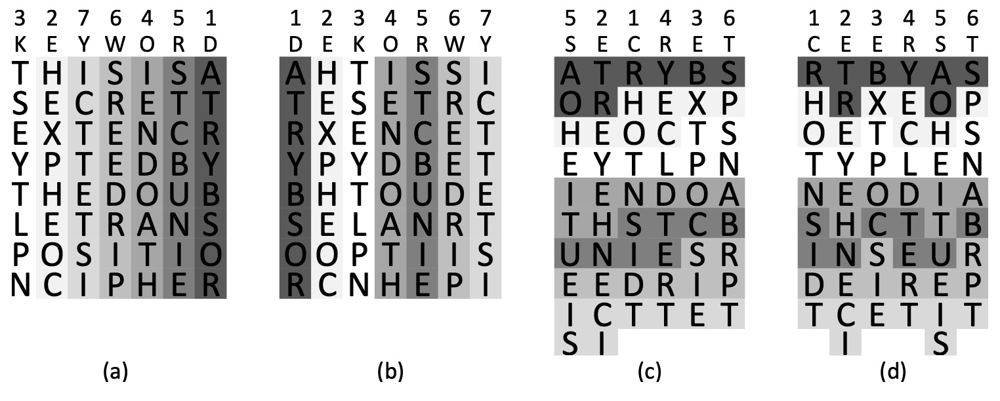

## 双列换位密码简介

在列换位密码中，我们可以通过猜测可能的列长，然后寻找可能的单词来攻击列换位密码。因此，为了使列换位密码更强壮，我们可以使用双列换位密码，其实这只是对明文进行了两次列换位密码。

在二战之前，双列换位密码普遍被认为很安全，

!!! Tip "例题"

	**下面我们对明文"THISISASECRETTEXTENCRYPTEDBYTHEDOUBLETRANSPOSITIONCIPHER"**

	**密钥：K1 = "KEYWORD" 以及 K2 = "SECRET"**

首先我们像是在加密列换位密码时那样使用密钥K1加密明文，如下图中的( a )和( b )所示。

接下来再将第一次列换位密码加密过的密文再使用密钥K2进行一次列换位密码加密，如下图中的( c )和( d )所示。



因此加密后的结果为：

`密文：RHOTNSIDTTREYEHNECIBXTPOCSIEYECLDTERTAOHEITUEISSPSNABRPT`

## 双列换位密码的程序实现

在python中加密明文，可以使用pycipher模块（使用pip install pycipher安装）。

```python
>>> from pycipher import ColTrans
>>> ColTrans("HOWAREU").encipher('The quick brown fox jumps over the lazy dog')
'QOURYINPHOTKOOLHBXVAUWMTDCFSEGERJEZ'
>>> ColTrans("HOWAREU").encipher('QOURYINPHOTKOOLHBXVAUWMTDCFSEGERJEZ')
'RTXDRIOAFEQPLWEOHHMGYKVCJNOUSZUOBTE'
```

## 双列换位密码的密码分析

2013年，乔治·拉斯里使用分而治之的方法解决了双列换位密码。
https://www.tandfonline.com/doi/abs/10.1080/01611194.2014.915269

