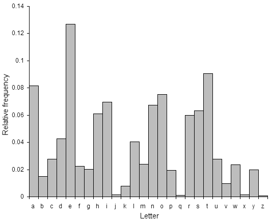

!!! Tip "必读"

	**上节中的密码棒密码其实也是栅栏密码的一种**

	**栅栏密码可分为N型和V型两种**

## 栅栏密码简介

所谓栅栏密码，就是将要加密的明文分为N个一组，再从每组的选出一个字母连起来，形成一段无规律的密文。

栅栏密码并非一种强的加密法，其加密原理限制了密钥的最高数量不可能超过明文字母数，而实际加密时密钥数目更少，因此有些密码分析员甚至能用手直接解出明文。

## 栅栏密码分类

栅栏密码可以分为两类，第一种是N型栅栏密码（加密方式源自百度百科）、第二种是V型栅栏密码（加密方式源自维基百科）。

### N型栅栏密码

使用密钥8（栅栏的栏数）加密一下明文`1234567891234567891234567891234567891`

```
1.......9.......8.......7.......6.......5..............................
.2.......1.......9.......8.......7.......6.............................
..3.......2.......1.......9.......8.......7............................
...4.......3.......2.......1.......9.......8...........................
....5.......4.......3.......2.......1.......9..........................
.....6.......5.......4.......3.......2.......1.........................
......7.......6.......5.......4.......3................................
.......8.......7.......6.......5.......4...............................
```

**首先画出8栏表格，明文由上至下顺序写上，当到达最低部时，再回到第一栏重新开始，一直重复直至整篇明文写完为止。**

横向读取表格即为密文：`1987652198763219874321985432196543217654387654`。


### V型栅栏密码

使用密钥8（栅栏的栏数）加密一下明文`Will invade Kentucky on October the eighth# signal is Frozen chicken'#`

```
W.............n.............b.............#.............r.............#
.i...........e.t...........o.e...........h. ...........F.o...........'.
..l.........K...u.........t...r.........t...s.........'...z.........n..
...l....... .....c.......c..... .......h.....i....... .....e.......e...
.... .....e.......k.....O.......t.....g.......g.....s.......n.....k....
.....i...d.........y... .........h...i.........n...i......... ...c.....
......n.a........... .n...........e.e...........a. ...........c.i......
.......v.............o............. .............l.............h.......
```
**在V型栅栏密码中，明文由上至下顺序写上，当到达最低部时，再回头向上，一直重复直至整篇明文写完为止。**

横向读取表格即为密文：`Wnb#r#ietoehFo'lkutrts'znl cc hi ee ekOtggsnkidy hini cna neea civo lh`。

## 栅栏密码的程序实现

!!! Tip "提示"

	**请将该文件存储为railfence.py，后文引用均指该文件**

```python
### 
###      Running in python3
###     FileName:railfence.py
###    Date:2018-08-07
###   Time:12:33 GMT
###  Author:nianhua
###
from math import *

class Railfence:

    def Nencipher(self,plaintext,key):

        ciphertext = ''
        for j in range(key):
            for i in range(len(plaintext)//key+1):
                try:
                    ciphertext += plaintext[i*key+j:i*key+j+1]
                except:
                    pass
        return ciphertext

    def Ndecipher(self,ciphertext,key):

        plaintext = []
        plainstr = ''
        column = len(ciphertext)//key
        remainder = len(ciphertext)%key
        for i in range(key):
            if i < remainder:
                plaintext.append(ciphertext[:column+1])
                ciphertext = ciphertext[column+1:]
            else:
                plaintext.append(ciphertext[:column])
                ciphertext = ciphertext[column:]
        for i in range(column+1):
            for j in range(key):
                try:
                    plainstr += plaintext[j][i]
                except:
                    pass
        return plainstr

    def Vencipher(self,plaintext,key):
        ciphertext = ''
        v = ceil(len(plaintext)/(2*(key-1)))
        for i in range(key):
            for j in range(v):
                try:
                    ciphertext += plaintext[(j*(key-1)*2) + i]
                    if(i != 0 and i != (key-1)):
                        ciphertext += plaintext[(j*(key-1)*2) + (((key-1)*2)-i)]
                except:
                    pass
        return ciphertext

    def Vdecipher(self,ciphertext,key):
        cipherarray = []        
        plaintext = ''
        v = ceil(len(ciphertext)/(2*(key-1)))
        rv = len(ciphertext)//(2*(key-1))
        re = len(ciphertext)%(2*(key-1))
        maxlen = 0
        cipherarray.append(ciphertext[:v])
        ciphertext = ciphertext[v:]
        if  re <= (key-1):
            for i in range(re-1):
                cipherarray.append(ciphertext[:2*rv+1])
                ciphertext = ciphertext[2*rv+1:]
            for i in range(key-(re+1)):
                cipherarray.append(ciphertext[:2*rv])
                ciphertext = ciphertext[2*rv:]
            cipherarray.append(ciphertext)
            ciphertext = ''
        else:        
            for i in range(2*key-re-2):
                cipherarray.append(ciphertext[:2*rv+1])
                ciphertext = ciphertext[2*rv+1:]
            for i in range(re-key):
                cipherarray.append(ciphertext[:(2*rv+2)])
                ciphertext = ciphertext[(2*rv+2):]
            cipherarray.append(ciphertext)
            ciphertext = ''
        cipherarray = [i for i in cipherarray if i != '']
        for i in cipherarray:
            if(len(i)>maxlen):
                maxlen = len(i)
        for i in range(ceil(maxlen/2)):
                for j in range(len(cipherarray)):
                    plaintext += cipherarray[j][:1]
                    cipherarray[j] = cipherarray[j][1:]
                for j in range(len(cipherarray)-2,0,-1):
                    plaintext += cipherarray[j][:1]
                    cipherarray[j] = cipherarray[j][1:]
        return plaintext

def main():

    newobj = Railfence()
    print(newobj.Vdecipher(newobj.Vencipher('Will invade Kentucky on October the eighth. signal is "Frozen chicken"',8),8))

if "__main__" == __name__ :

    main()
```

## 栅栏密码的破解

!!! Warning "前提"

	**栅栏密码的密钥空间必定小于密文长度的1/2（因为如果密钥大于密文长度的1/2，则结束部分的明文未被加密）。**


从上面的前提我们可以知道栅栏密码的密钥空间较小，因此可以使用暴力破解的方式进行攻击。

首先我们编写两种栅栏密码的加密解密代码。

---

对V型加密后的密文`Wnb.r.ietoeh Fo"lKutrts"znl cc hi ee ekOtggsnkidy hini cna neea civo lh`进行暴力破解

```python
from railfence import *

newobj = Railfence()
string = 'Wnb.r.ietoeh Fo"lKutrts"znl cc hi ee ekOtggsnkidy hini cna neea civo lh'
for i in range(2,10):
	print(i,newobj.Vdecipher(string,i))
```

运行程序，查看效果：


**我们可以看到第八行是明显是有意义的明文，因此密钥为8**

---

!!! Tip "问题"

	**如果密文由100位字母组成，那我们至少需要尝试50个密钥？**

## 栅栏密码小结

!!! Tip "结论"

	**栅栏密码是一个非常容易破解的密码，密码分析者只需要尝试几个密钥即可找到正确的明文。如果您知道某些明文，或者可以猜出一些明文，那么将更容易找到密钥。**

	**换位密码的一个特点是字符的频率分布与自然文本的频率分布相同（因为没有进行替换，它只是混合的顺序）。换句话说，它应该看起来像这样：**

	