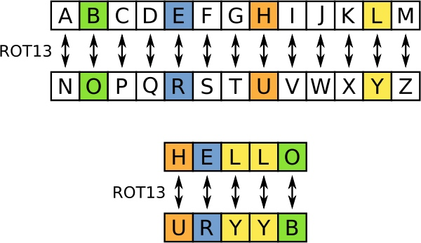

替换密码又名代换式密码，是密码学中按规律将文字加密的一种方式。

替换密码是指先建立一个替换表，加密时将需要加密的明文依次通过查表替换为相应的字符，明文字符被逐个替换后，生成无任何意义的字符串，即密文，替换密码的密钥就是其替换表。

根据密码加/解密时使用的替换表的多少，替换密码又可分为单表替换密码和多表替换密码。

比如猪圈密码就是常见的替换密码，其将字母转换成由格子组成的密文。

---

再比如夏洛克·福尔摩斯中的跳舞小人，其用跳舞小人替换英语，福尔摩斯最后根据分析字母频率来破解密码。

----

!!! Tip "举例"

	**我们来看一种简单的替换密码 ROT13**

**ROT13的原理是：**

A换成N、B换成O、依此类推到M换成Z，然后序列反转：N换成A、O换成B、最后Z换成M。

我们可以看到，加密'HELLO'的时候，H被替换成U、E被替换成R...

替换密码最著名的例子有:凯撒密码、维吉尼亚密码、简单替换密码等等...

!!! Warning "词频分析"

	**针对替换密码最有效的攻击方式是词频分析。**
