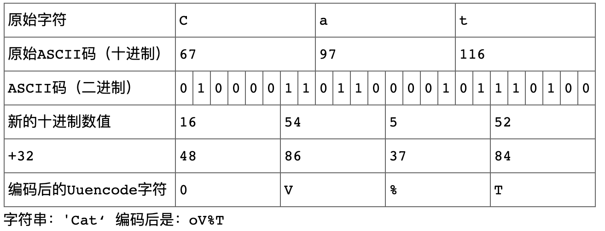

### 简介

UUencode是一种二进制到文字的编码，最早在unix 邮件系统中使用，全称：Unix-to-Unix encoding，UUencode将输入文本以每三个字节为单位进行编码，如果最后剩下的资料少于三个字节，不够的部份用零补齐。三个字节共有24个Bit，以6-bit为单位分为4个组，每个组以十进制来表示所出现的字节的数值。这个数值只会落在0到63之间。然后将每个数加上32，所产生的结果刚好落在ASCII字符集中可打印字符（32-空白…95-底线）的范围之中。

### 扩展

它与base64及其相似，但是UUencode不用写映射表，是通过加32转换到可打印字符范围中。比起base64来，更为简单！

在线[UUencode](http://web.chacuo.net/charsetuuencode)编码解码。